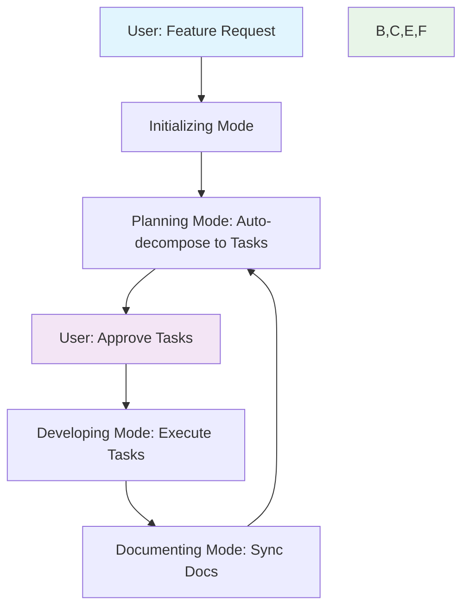

# 🤖 Cursor Rules System v2
**Comprehensive AI-Driven Development Workflow**

Hệ thống quy tắc cho Cursor Agent tự động hoá toàn bộ quy trình phát triển: từ phân rã feature → tasks → code → docs, với user chỉ cần "in-the-loop" approval.

## 🎯 Tổng quan


## 📂 Cấu trúc thư mục
```
cursor/rules_v2/
├── core/                    # Rules luôn được load (alwaysApply: true)
│   ├── master-orchestrator.mdc    # State machine điều phối modes
│   ├── context-loader.mdc         # Smart context loading (token optimization)
│   ├── safe-code-generation.mdc   # R-M-W-V cycle
│   └── user-interaction.mdc       # Smart confirmation, Vietnamese style
├── modes/                   # Mode-specific rules (triggered by context)
│   ├── initializing-mode.mdc      # Bootstrap project structure
│   ├── planning-agent.mdc         # Auto-decompose features → tasks
│   ├── developing-mode.mdc        # Execute tasks với progress tracking
│   └── documenting-mode.mdc       # Sync docs với code changes
├── utilities/               # Helper rules (on-demand)
│   ├── lint-rules.mdc            # CI validation cho rule files
│   └── log-rollover.mdc          # Archive work logs khi quá dài
├── templates/               # Templates cho docs/tasks/blueprints
│   ├── task-template.md
│   ├── progress-report-template.md
│   └── blueprint-template.yaml
└── README.md               # This file
```

## 🔄 4 Modes Workflow

### 1. 🚀 Initializing Mode
**Trigger**: Repo thiếu `docs/` scaffold  
**Action**: Tạo folder structure, templates, task-index.json  
**Exit**: Scaffold hoàn tất → Planning

### 2. 🧠 Planning Mode + Planning Agent
**Trigger**: Feature mới cần tasks, hoặc backlog rỗng  
**Action**: 
- Parse `docs/features/*/requirements/*.md`
- Tự động tạo `TASK_XXX.md` files
- User approve/reject qua Interactive MCP  
- Update `task-index.json`  
**Exit**: ≥1 task approved → Developing

### 3. 🔧 Developing Mode
**Trigger**: Có active tasks  
**Action**:
- Load context theo priority (task file + related code)
- Execute với Safe Code Generation (R-M-W-V)
- Update work logs + progress tracking
- Mark acceptance criteria ✅
**Exit**: Tasks done + docs out-of-sync → Documenting

### 4. 📚 Documenting Mode  
**Trigger**: Code thay đổi, docs chưa sync  
**Action**:
- Detect changes (API, architecture, features)
- Update docs dùng templates
- Generate diagrams, API specs
**Exit**: Docs synced → Planning (next sprint)

## 🎛️ Rule Types & Front-matter

### 4 loại Rule được xác định bởi front-matter:
```yaml
# Always Apply (core rules)
---
description: "Luôn load, cross-cutting concerns"
globs: 
alwaysApply: true
---

# Auto Attach (language/framework rules)  
---
description: "Auto load khi file match glob"
globs: "src/**/*.ts, *.json"
alwaysApply: false
---

# Agent Select (contextual rules)
---  
description: "Agent chọn khi cần, based on description"
globs: 
alwaysApply: false
---

# Manual (user-reference only)
---
description: ""
globs: ""
alwaysApply: false
---
```

## 🚀 Cách sử dụng

### Setup Initial
1. Copy `cursor/rules_v2/` → `.cursor/rules/` trong project
2. Chạy Cursor Agent: "bootstrap project"
3. Agent sẽ tạo docs structure + templates

### Daily Workflow
1. **Feature request**: "Implement user authentication"
2. **Planning Agent** tự động:
   - Parse requirements (nếu có)
   - Tạo tasks (TASK_001, TASK_002...)
   - Show approval table
3. **User approve tasks**: ✅ hoặc ❌
4. **Developing Mode**: Execute từng task
5. **Docs sync**: Tự động update khi code thay đổi

### Ví dụ Flow
```
User: "Add JWT authentication to the API"
→ Planning Agent: Creates TASK_123 "Implement JWT middleware", TASK_124 "Add auth tests"
→ User: ✅ approve both
→ Developing Mode: Execute TASK_123 → safe code gen → update progress
→ Developing Mode: Execute TASK_124 → tests + docs  
→ Documenting Mode: Update API docs với auth endpoints
→ Planning Mode: Ready for next feature
```

## 📊 Key Features

### ✅ Smart Context Loading
- **3-tier priority**: HIGH (task+src) → MEDIUM (blueprint) → LOW (overview)
- **Token optimization**: chỉ load cần thiết theo mode
- **Caching**: tránh reload files đã có

### ✅ Safe Code Generation  
- **R-M-W-V**: Read→Modify→Write→Verify cycle
- **Strategy selection**: patch vs overwrite
- **Error recovery**: auto-retry + corruption detection

### ✅ Progress Tracking
- **Real-time**: work logs, % completion, blockers
- **Archive system**: logs >50 lines → archive files
- **Cross-references**: task ↔ features ↔ code

### ✅ Quality Gates
- **CI linting**: validate rule format + logic
- **Gate criteria**: blueprint → code → deployment
- **Template consistency**: standardized docs

## 🔧 Advanced Configuration

### Custom Rules
Thêm rules mới:
```bash
# Language-specific
.cursor/rules/languages/python-auto.mdc

# Project-specific  
.cursor/rules/project/security-always.mdc

# Temporary sprint rules
.cursor/rules/sprint/s2025-01-manual.mdc
```

### CI Integration
```yaml
# .github/workflows/rules-validation.yml
- name: Validate Cursor Rules
  run: cursor-rules-lint .cursor/rules/
```

### Metrics & Analytics
- Token usage per mode
- Average task completion time  
- Context loading efficiency
- Rule activation frequency

## 🚨 Troubleshooting

### Common Issues
1. **Rules không load**: Check front-matter YAML syntax
2. **Context quá lớn**: Review context-loader priority
3. **Tasks không approve**: Check planning-agent description
4. **Mode stuck**: Manual override: "switch to X mode"

### Debug Commands
```bash
# Check rule validation
cursor-rules-lint --verbose .cursor/rules/

# Manual mode switch
"Override: switch to developing mode for TASK_123"

# Context analysis  
"Show me current context load + token usage"
```

## 🎉 Benefits
- **90% tự động**: User chỉ approve/reject, không viết tasks
- **Token tiết kiệm**: Smart loading, archive logs
- **Consistent quality**: Templates, safe code gen, CI validation  
- **Full traceability**: Work logs, progress tracking, cross-refs
- **Scalable**: Thêm rules dễ dàng, không conflict

## 📈 Migration từ Rules v1
1. Backup rules cũ
2. Copy rules_v2 → `.cursor/rules/`
3. Migrate custom rules + front-matter
4. Test với project nhỏ trước khi full migration

---
**Version**: 2.0  
**Compatible**: Cursor 0.48+  
**License**: MIT  
**Maintainer**: AI Engineering Team 